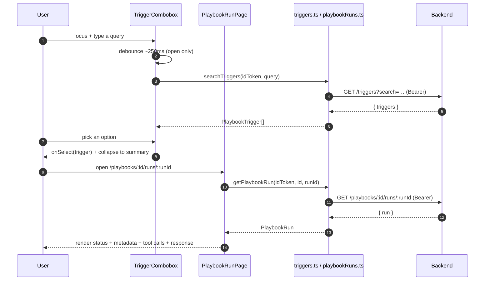
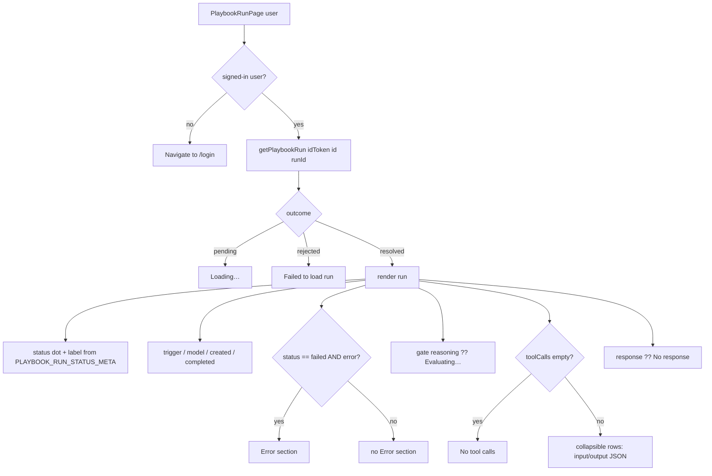

# Diagrams — Frontend Playbook Run-History Module

## Run-history data flow (swimlane)

```mermaid
sequenceDiagram
    autonumber
    participant U as User
    participant Combo as TriggerCombobox
    participant Page as PlaybookRunPage
    participant API as triggers.ts / playbookRuns.ts
    participant BE as Backend

    U->>Combo: focus + type a query
    Combo->>Combo: debounce ~250ms (open only)
    Combo->>API: searchTriggers(idToken, query)
    API->>BE: GET /triggers?search=… (Bearer)
    BE-->>API: { triggers }
    API-->>Combo: PlaybookTrigger[]
    U->>Combo: pick an option
    Combo-->>U: onSelect(trigger) + collapse to summary

    U->>Page: open /playbooks/:id/runs/:runId
    Page->>API: getPlaybookRun(idToken, id, runId)
    API->>BE: GET /playbooks/:id/runs/:runId (Bearer)
    BE-->>API: { run }
    API-->>Page: PlaybookRun
    Page-->>U: render status + metadata + tool calls + response
```

## Run-detail render decision (use case)

```mermaid
flowchart TD
    A[PlaybookRunPage user] --> B{signed-in user?}
    B -->|no| L[Navigate to /login]
    B -->|yes| C[getPlaybookRun idToken id runId]
    C --> D{outcome}
    D -->|pending| E[Loading…]
    D -->|rejected| F[Failed to load run]
    D -->|resolved| G[render run]
    G --> H[status dot + label from PLAYBOOK_RUN_STATUS_META]
    G --> I[trigger / model / created / completed]
    G --> J{status == failed AND error?}
    J -->|yes| K[Error section]
    J -->|no| M[no Error section]
    G --> N[gate reasoning ?? Evaluating…]
    G --> O{toolCalls empty?}
    O -->|yes| P[No tool calls]
    O -->|no| Q[collapsible rows: input/output JSON]
    G --> R[response ?? No response]
```
